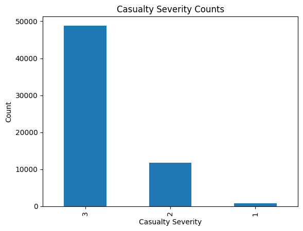
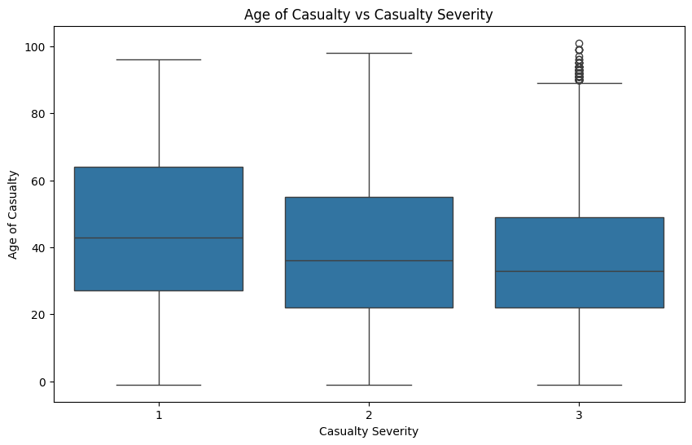
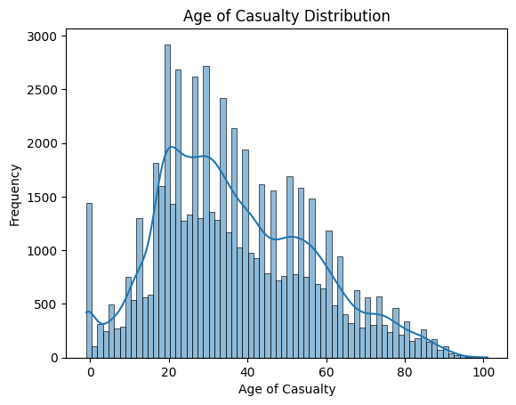
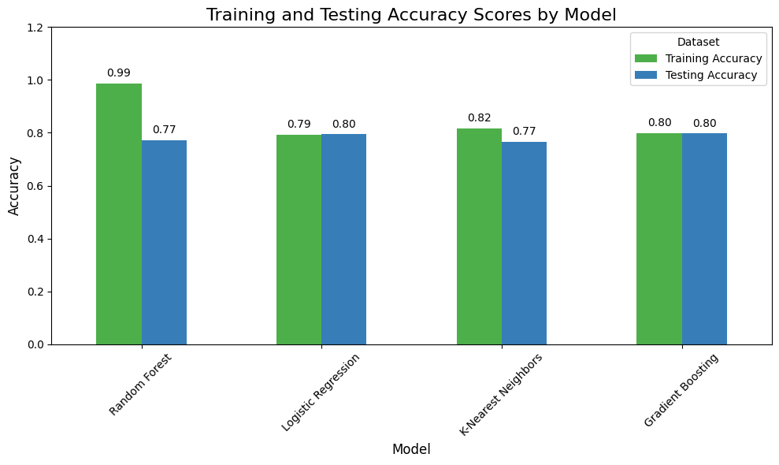
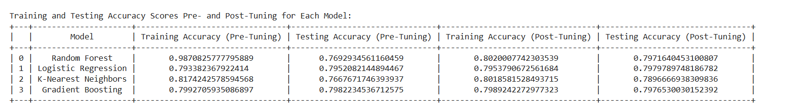
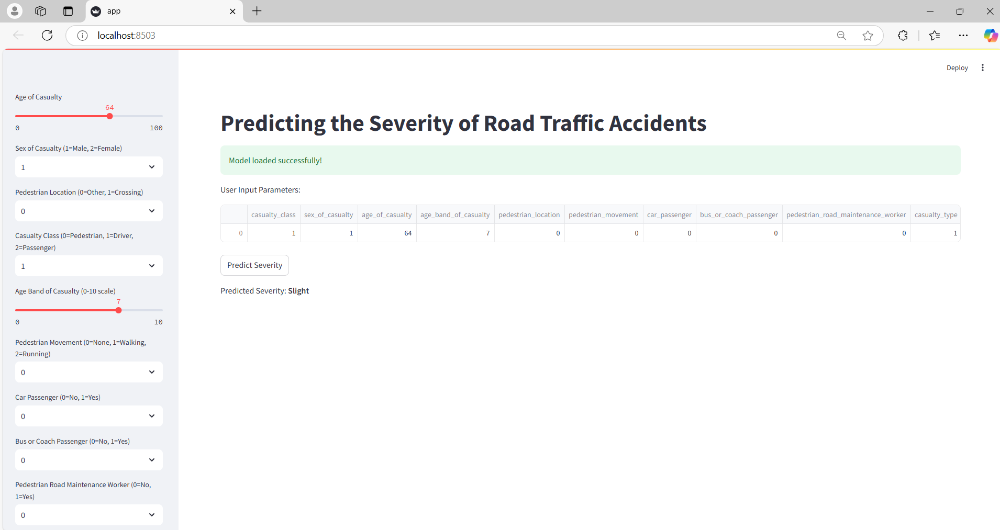

# Project Title: Predicting the Severity of Road Traffic Accidents

- **Author Name:** Divya Aitipamula
- **Semester:** Fall'24
- **Prepared for:** UMBC Data Science Master's Degree Capstone by Dr. Chaojie (Jay) Wang
- **Github:** [https://github.com/DivyaAiti/UMBC-DATA606-Capstone](https://github.com/DivyaAiti/UMBC-DATA606-Capstone])
- **LinkedIn:** [https://www.linkedin.com/in/divyaaitipamula/](https://www.linkedin.com/in/divyaaitipamula/])
- **PowerPoint Presentation:** [Link](https://github.com/DivyaAiti/UMBC-DATA606-Capstone/blob/main/docs/Final%20Project.pptx)
- **Youtube:** [Link](https://www.youtube.com/watch?v=KoFg9nBqzuU&ab_channel=DivyaAitipamula)
- **Streamlit:** [Link](https://share.streamlit.io/)

---

## Background

### What is it about?
The project focuses on predicting the severity of road traffic accidents using machine learning techniques. Road traffic accidents are a major cause of injury and death worldwide, leading to significant human suffering and economic loss. This project aims to leverage data-driven methods to understand the key factors that contribute to the severity of these accidents (categorized as fatal, serious, or slight) and to build predictive models that can help anticipate the severity of future accidents.

### Why does it matter?
Predicting the severity of road traffic accidents is crucial for several reasons:
- **Enhancing Emergency Response:** By predicting accident severity, emergency responders can prioritize resources and provide timely assistance, potentially saving lives.
- **Improving Road Safety:** Insights from the model can inform policymakers and urban planners in identifying high-risk areas and implementing targeted road safety measures.
- **Insurance and Risk Assessment:** Accurate predictions can assist insurance companies in better-assessing risks, which can lead to fairer premiums and improved customer satisfaction.
- **Data-Driven Decision Making:** Understanding the factors contributing to accident severity can help in making data-driven decisions to prevent future accidents, ultimately reducing fatalities and injuries.

### Research Questions?
- What are the most significant factors influencing the severity of road traffic accidents?
- How accurately can machine learning models predict the severity of road traffic accidents?
- Which combinations of factors (e.g., environmental conditions, vehicle types, driver demographics) are most strongly associated with severe accidents?

---

## Data

- **Data Sources:** The dataset used for this project is obtained from the UK Department for Transport's road casualty statistics and Kaggle. 
  - [UK Department for Transport](https://www.gov.uk/government/statistics/reported-road-casualties-great-britain-annual-report-2022/reported-road-casualties-great-britain-annual-report-2022)  
  - [Kaggle Dataset](https://www.kaggle.com/datasets/juhibhojani/road-accidents-data-2022/data)
- **Data Size:** 5MB  
- **Data Shape:** 61352 rows and 20 columns.  
- **Time Period:** The dataset covers road traffic accidents for the year 2022.  
- **Each Row Represents:** A single casualty occurrence in a road traffic accident for the year 2022. Each entry corresponds to an individual involved in an accident, including their details, the accident circumstances, and the severity of their injuries.

### Data Dictionary

| **Column Name**                        | **Data Type** | **Definition**                                                                    | **Potential Values**                                                             |
|----------------------------------------|---------------|------------------------------------------------------------------------------------|----------------------------------------------------------------------------------|
| `Status`                               | String        | The status of the accident (e.g., reported, under investigation).                   | "Reported", "Under Investigation", etc.                                          |
| `Accident_Index`                       | String        | A unique identifier for each reported accident.                                     | Alphanumeric string (e.g., "2022070151244")                                      |
| `Accident_Year`                        | Integer       | The year in which the accident occurred.                                            | Year (e.g., 2022)                                                                |
| `Accident_Reference`                   | String        | A reference number associated with the accident.                                    | Alphanumeric string                                                             |
| `Vehicle_Reference`                    | Integer       | A reference number for the involved vehicle in the accident.                        | Integer (e.g., 1, 2, 3, etc.)                                                   |
| `Casualty_Reference`                   | Integer       | A reference number for the casualty involved in the accident.                       | Integer (e.g., 1, 2, 3, etc.)                                                   |
| `Casualty_Class`                       | Integer       | Indicates the class of the casualty (e.g., driver, passenger, pedestrian).          | 1 = Driver/Rider, 2 = Passenger, 3 = Pedestrian                                  |
| `Sex_of_Casualty`                      | Integer       | The gender of the casualty.                                                        | 1 = Male, 2 = Female, -1 = Unknown                                               |
| `Age_of_Casualty`                      | Integer       | The age of the casualty.                                                           | Range from 0 to 100+, -1 = Unknown                                               |
| `Age_Band_of_Casualty`                 | Integer       | Age group to which the casualty belongs.                                           | 1 = 0-5, 2 = 6-10, 3 = 11-15, ..., 11 = 95+                                      |
| `Casualty_Severity`                    | Integer       | The severity of the casualty's injuries.                                           | 1 = Fatal, 2 = Serious, 3 = Slight                                               |
| `Pedestrian_Location`                  | Integer       | The location of the pedestrian at the time of the accident.                        | 0 = Not a Pedestrian, 1 = Crossing on Pedestrian Crossing, ..., 5 = In Carriageway|
| `Pedestrian_Movement`                  | Integer       | The movement of the pedestrian during the accident.                                | 0 = Not a Pedestrian, 1 = Crossing from Nearside, 2 = Crossing from Offside, etc. |
| `Car_Passenger`                        | Integer       | Indicates whether the casualty was a car passenger at the time of the accident.     | 0 = No, 1 = Yes                                                                  |
| `Bus_or_Coach_Passenger`               | Integer       | Indicates whether the casualty was a bus or coach passenger.                       | 0 = No, 1 = Yes                                                                  |
| `Pedestrian_Road_Maintenance_Worker`   | Integer       | Indicates whether the casualty was a road maintenance worker.                      | 0 = No, 1 = Yes                                                                  |
| `Casualty_Type`                        | Integer       | The type of casualty (e.g., driver/rider, passenger, pedestrian).                  | 1 = Driver/Rider, 2 = Passenger, 3 = Pedestrian, etc.                            |
| `Casualty_Home_Area_Type`              | Integer       | The type of area in which the casualty resides (e.g., urban, rural).               | 1 = Urban, 2 = Small Town, 3 = Rural                                             |
| `Casualty_IMD_Decile`                  | Integer       | The IMD decile of the area where the casualty resides (a measure of deprivation).  | 1 (most deprived) to 10 (least deprived), -1 = Unknown                           |
| `LSOA_of_Casualty`                     | String        | The Lower Layer Super Output Area (LSOA) associated with the casualty's location.  | Alphanumeric code (e.g., "E01033378")                                            |

---

### Target Variable for the ML Model 
- **`Casualty_Severity`**: This column is the target variable in the machine learning model. It represents the severity of the accident and is categorized into three levels: 1 = Fatal, 2 = Serious and, 3 = Slight.

### Selected Features/Predictors for the ML Models
The following columns are selected as features (predictors) to train the ML models:

- **`Casualty_Class`**: Class of the casualty (e.g., driver, passenger, pedestrian).
- **`Sex_of_Casualty`**: Gender of the casualty.
- **`Age_of_Casualty`**: Age of the casualty.
- **`Age_Band_of_Casualty`**: Age group of the casualty.
- **`Pedestrian_Location`**: Location of the pedestrian during the accident.
- **`Pedestrian_Movement`**: Movement of the pedestrian during the accident.
- **`Car_Passenger`**: Whether the casualty was a car passenger.
- **`Bus_or_Coach_Passenger`**: Whether the casualty was a bus or coach passenger.
- **`Pedestrian_Road_Maintenance_Worker`**: Whether the casualty was a road maintenance worker.
- **`Casualty_Type`**: Type of casualty.
- **`Casualty_Home_Area_Type`**: Home area type of the casualty.
- **`Casualty_IMD_Decile`**: IMD decile of the casualty's residence.
- **`LSOA_of_Casualty`**: LSOA code associated with the casualty's location.

---

## Exploratory Data Analysis (EDA)

**Data Cleansing and Preprocessing:**
   The focus was placed on the target variable, `casualty_severity`, and the selected features that are relevant for predicting the severity of accidents. All other irrelevant columns were dropped to streamline the analysis. Summary statistics of the key variables were produced to understand the data distribution and to assess key metrics such as central tendencies and spread. These statistics provided insights into the characteristics of the selected features and the overall dataset.

- **Missing Values**: No missing values were found, ensuring the completeness of the dataset.
- **Duplicate Rows**: The dataset was checked for duplicate rows, and no duplicates were detected. 

---

### Data Visualization:
**Univariate Analysis**:
   The distribution of the target variable, `casualty_severity`, was analyzed to assess the balance of the dataset. Using the `value_counts()` function, occurrences of each severity level—Fatal, Serious, and Slight—were calculated. A bar plot was generated, where the x-axis represents severity levels (1 = Fatal, 2 = Serious, 3 = Slight), and the y-axis shows the frequency of each category.

**Bivariate Analysis**:
   A bivariate analysis was conducted to explore the relationship between `casualty_severity` and `age_of_casualty`. A boxplot was used to visualize the connection between accident severity and age. The x-axis represents different severity levels (Fatal, Serious, Slight), while the y-axis shows the ages of individuals involved in the accidents.
   This analysis identified patterns in how age relates to the severity of injuries, highlighting age groups more prone to severe accidents. For example, certain age groups might exhibit higher fatality or serious injury rates, indicating the need for age-specific safety measures.

**Visualizing the Data**:
   A histogram with a Kernel Density Estimate (KDE) curve was created to examine the distribution of `age_of_casualty`. The x-axis represents different age groups involved in accidents, while the y-axis shows the frequency of occurrences.
   This visualization uncovered trends in accident occurrence across various age groups, indicating which age ranges are most commonly affected. The KDE curve provided a smoother view of the distribution, aiding in detecting patterns that might influence model performance.

### Data Cleansing and Feature Engineering:

During the Data Cleansing and Feature Engineering process, relevant features were selected from the dataset to be used in the analysis, such as accident year, casualty details, pedestrian movement, and so on. Categorical variables, like casualty class and home area type, were transformed into numerical values using Label Encoding to make the data machine-readable. For numerical features, such as age and pedestrian movement, Standard Scaling was applied to normalize the data and ensure consistency in feature scaling. These steps were necessary to prepare the dataset for machine learning models.

---

## Model Training, Evaluation, and Hypertuning

### Selected Models for Predictive Analytics
1. **Random Forest Classifier**
2. **Logistic Regression**
3. **K-Nearest Neighbors (KNN)**
4. **Gradient Boosting Classifier**

### Training Methodology
1. **Data Splitting**: Dataset was split into **80% training** and **20% testing** to allow the model to generalize on unseen data.
2. **Python Packages**: 
   - **scikit-learn**: Model training, evaluation, and tuning.
   - **pandas** and **NumPy**: Data manipulation.
   - **Matplotlib** and **Seaborn**: Visualization for EDA insights.
3. **Development Environment**: Google Colab for computational support, GitHub for version control.

### Initial Model Evaluation (Pre-Tuning)

| Model                  | Training Accuracy (%) | Testing Accuracy (%) | Precision (%) | Recall (%) | F1 Score (%) |
|------------------------|-----------------------|----------------------|---------------|------------|--------------|
| **Random Forest**      | 98.71                 | 77.00               | 71.00         | 77.00      | 73.00        |
| **Logistic Regression**| 79.34                 | 80.00               | 69.00         | 80.00      | 71.00        |
| **K-Nearest Neighbors**| 81.74                 | 77.00               | 70.00         | 77.00      | 72.00        |
| **Gradient Boosting**  | 79.92                 | 80.00               | 73.00         | 80.00      | 73.00        |

### Observations on Overfitting

- **Random Forest**: Showed overfitting, with high training accuracy (**98.71%**) but lower testing accuracy (**77.29%**), indicating reduced generalization capability on unseen data.
- **Logistic Regression**: Displayed a balanced performance with **79.34%** training accuracy and **79.52%** testing accuracy, suggesting minimal overfitting and stable generalization.
- **K-Nearest Neighbors (KNN)**: Demonstrated mild overfitting with **81.74%** training accuracy and **76.67%** testing accuracy, indicating slight generalization issues.
- **Gradient Boosting**: Achieved balanced accuracy across training and testing datasets with **79.92%** training and **79.83%** testing accuracy, indicating strong generalization capabilities.

---

### Hypertuning with RandomizedSearchCV

Hyperparameter tuning was conducted using **RandomizedSearchCV** to enhance model performance and generalization. The table below outlines the parameter grids and optimal configurations for each model.

| Model                | Parameter Grid                                | Best Parameters Identified             |
|----------------------|-----------------------------------------------|----------------------------------------|
| **Random Forest**    | `n_estimators`, `max_depth`, `min_samples_split`, `min_samples_leaf` | `n_estimators=100`, `max_depth=10`, `min_samples_split=5`, `min_samples_leaf=2` |
| **Logistic Regression** | `penalty`, `C`, `solver`                  | `penalty='l1'`, `C=0.1`, `solver='liblinear'` |
| **K-Nearest Neighbors** | `n_neighbors`, `weights`, `p`             | `n_neighbors=7`, `weights='uniform'`, `p=1` |
| **Gradient Boosting**   | `n_estimators`, `learning_rate`, `max_depth` | `n_estimators=100`, `learning_rate=0.1`, `max_depth=3` |

---

### Model Evaluation - Post-Tuning Results

Post-tuning, the models demonstrated improved accuracy and generalization, as detailed below:

### Observations on Tuning Results
- **Random Forest**: Tuning reduced overfitting by lowering training accuracy from 98.71% to 80.28% and slightly improved testing accuracy from 76.93% to 79.69%, enhancing the model's generalization.
- **Logistic Regression**: Already balanced pre-tuning, tuning led to a small increase in testing accuracy from 79.52% to 79.78%, confirming stable performance and minimal overfitting.
- **K-Nearest Neighbors (KNN)**: Tuning reduced training accuracy from 81.74% to 80.84% while increasing testing accuracy from 76.68% to 78.96%, indicating improved generalization.
- **Gradient Boosting**: Displayed consistent performance; training accuracy slightly increased from 79.93% to 80.13%, with testing accuracy remaining steady around 79.79%, demonstrating robustness and stability.

### Best Model Selection
Based on post-tuning results, **Logistic Regression** was selected as the best model with a testing accuracy of **79.79%**, providing the most balanced performance across training and testing datasets.

---

## Web Application Development

A user-friendly web application was built using **Streamlit** to make the model accessible and interactive. Key features include:
1. **User Input**: Fields for entering accident details, such as casualty class, age, pedestrian location, and other selected features.
2. **Prediction Output**: After processing the input data, the app displays the predicted accident severity, helping users understand potential risk levels.

---

## Conclusion

### Summary of Findings
The project successfully demonstrated the predictive capabilities of machine learning models in assessing road traffic accident severity. **Logistic Regression** emerged as the best model, providing actionable insights for emergency response, insurance assessment, and urban planning.

### Potential Applications
1. **Traffic Safety**: Insights from the model can help policymakers implement safety measures in high-risk areas.
2. **Insurance**: The model enables insurers to assess accident severity, leading to fairer premiums.
3. **Emergency Response**: Predicting severity supports optimized resource allocation in emergencies, potentially saving lives.

### Limitations and Future Directions
1. **Data Scope**: Expanding the dataset across more regions and years could improve model applicability.
2. **Additional Features**: Incorporating external factors, such as weather conditions and traffic density, may enhance prediction accuracy.
3. **Advanced Models**: Future research could explore deep learning models to potentially improve predictive capabilities.

---

## References

- [UK Department for Transport](https://www.gov.uk/government/statistics/reported-road-casualties-great-britain-annual-report-2022/reported-road-casualties-great-britain-annual-report-2022)
- [Kaggle Dataset](https://www.kaggle.com/datasets/juhibhojani/road-accidents-data-2022/data)
