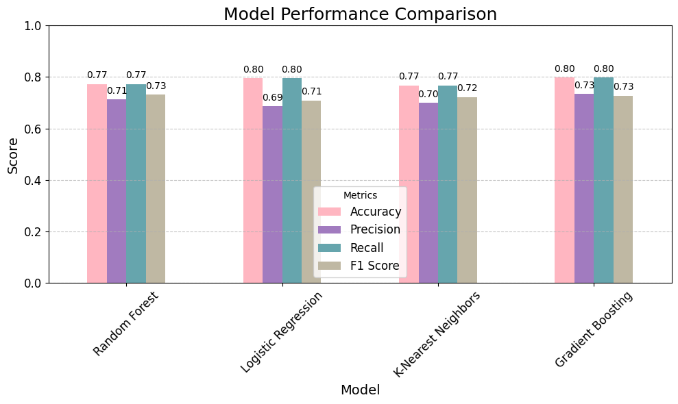

# Project Title: Predicting the Severity of Road Traffic Accidents

- **Author Name:** Divya Aitipamula
- **Semester:** Fall'24
- **Prepared for:** UMBC Data Science Master's Degree Capstone by Dr. Chaojie (Jay) Wang
- **GitHub:** [https://github.com/DivyaAiti/UMBC-DATA606-Capstone](https://github.com/DivyaAiti/UMBC-DATA606-Capstone)
- **LinkedIn profile:** [https://www.linkedin.com/in/divyaaitipamula/](https://www.linkedin.com/in/divyaaitipamula/)

---

## Background

### Project Overview
This project focuses on predicting the severity of road traffic accidents using machine learning. Road traffic accidents are a major cause of injury and death worldwide, leading to significant human suffering and economic loss. The goal is to leverage data-driven methods to understand the key factors contributing to accident severity (categorized as fatal, serious, or slight) and to build predictive models that help anticipate the severity of future accidents.

### Importance
Predicting accident severity is critical for several reasons:
- **Enhancing Emergency Response:** Allows emergency responders to prioritize resources and provide timely assistance, potentially saving lives.
- **Improving Road Safety:** Insights from the model inform policymakers and urban planners in identifying high-risk areas and implementing targeted road safety measures.
- **Insurance and Risk Assessment:** Accurate predictions can assist insurance companies in better assessing risks, which can lead to fairer premiums and improved customer satisfaction.
- **Data-Driven Decision Making:** Understanding factors contributing to accident severity helps in making data-driven decisions to prevent future accidents, ultimately reducing fatalities and injuries.

### Research Questions
- What are the most significant factors influencing the severity of road traffic accidents?
- How accurately can machine learning models predict the severity of road traffic accidents?
- Which combinations of factors (e.g., environmental conditions, vehicle types, driver demographics) are most strongly associated with severe accidents?

---

## Data

- **Data Sources:** The dataset for this project was obtained from:
  - [UK Department for Transport](https://www.gov.uk/government/statistics/reported-road-casualties-great-britain-annual-report-2022/reported-road-casualties-great-britain-annual-report-2022)
  - [Kaggle Dataset](https://www.kaggle.com/datasets/juhibhojani/road-accidents-data-2022/data)
- **Data Size:** 5MB  
- **Data Shape:** 61352 rows and 20 columns  
- **Time Period:** Covers road traffic accidents for the year 2022  
- **Each Row Represents:** A single casualty occurrence in a road traffic accident for the year 2022, with details about the casualty, accident circumstances, and injury severity.

### Data Dictionary

| Column Name                        | Data Type | Definition                                                                 | Potential Values |
|------------------------------------|-----------|---------------------------------------------------------------------------|------------------|
| Status                             | String    | Status of the accident (e.g., reported, under investigation).             | "Reported", etc. |
| Accident_Index                     | String    | Unique identifier for each reported accident.                             | Alphanumeric     |
| Accident_Year                      | Integer   | Year of the accident.                                                     | Year (e.g., 2022) |
| Accident_Reference                 | String    | Accident reference number.                                                | Alphanumeric     |
| Vehicle_Reference                  | Integer   | Reference number for the involved vehicle.                                | Integer (1, 2...) |
| Casualty_Reference                 | Integer   | Reference number for the casualty.                                        | Integer (1, 2...) |
| Casualty_Class                     | Integer   | Class of the casualty (driver, passenger, pedestrian).                    | 1 = Driver, 2 = Passenger, 3 = Pedestrian |
| Sex_of_Casualty                    | Integer   | Gender of the casualty.                                                   | 1 = Male, 2 = Female, -1 = Unknown |
| Age_of_Casualty                    | Integer   | Age of the casualty.                                                      | 0 to 100+, -1 = Unknown |
| Age_Band_of_Casualty               | Integer   | Age group of the casualty.                                                | 1 = 0-5, 2 = 6-10, ..., 11 = 95+ |
| Casualty_Severity                  | Integer   | Severity of casualty's injuries.                                          | 1 = Fatal, 2 = Serious, 3 = Slight |
| Pedestrian_Location                | Integer   | Location of the pedestrian during the accident.                           | 0 = Not a Pedestrian, ..., 5 = In Carriageway |
| Pedestrian_Movement                | Integer   | Movement of the pedestrian during the accident.                           | 0 = Not a Pedestrian, ..., 2 = Crossing |
| Car_Passenger                      | Integer   | Indicates if the casualty was a car passenger.                            | 0 = No, 1 = Yes |
| Bus_or_Coach_Passenger             | Integer   | Indicates if the casualty was a bus or coach passenger.                   | 0 = No, 1 = Yes |
| Pedestrian_Road_Maintenance_Worker | Integer   | Indicates if the casualty was a road maintenance worker.                  | 0 = No, 1 = Yes |
| Casualty_Type                      | Integer   | Type of casualty.                                                         | 1 = Driver/Rider, 2 = Passenger, 3 = Pedestrian |
| Casualty_Home_Area_Type            | Integer   | Type of area where the casualty resides.                                  | 1 = Urban, 2 = Small Town, 3 = Rural |
| Casualty_IMD_Decile                | Integer   | IMD decile for casualty's residence area.                                 | 1 = Most deprived, 10 = Least deprived |
| LSOA_of_Casualty                   | String    | LSOA code for casualty's location.                                        | Alphanumeric (e.g., "E01033378") |

---

## Target Variable for the ML Model 
- **Casualty_Severity**: The target variable in the model, categorized into 1 = Fatal, 2 = Serious, and 3 = Slight.

### Selected Features/Predictors for the ML Models
The following columns were selected as features to train the ML models:
- Casualty_Class, Sex_of_Casualty, Age_of_Casualty, Age_Band_of_Casualty, Pedestrian_Location, Pedestrian_Movement, Car_Passenger, Bus_or_Coach_Passenger, Pedestrian_Road_Maintenance_Worker, Casualty_Type, Casualty_Home_Area_Type, Casualty_IMD_Decile, LSOA_of_Casualty.

---

## Exploratory Data Analysis (EDA)

**Data Cleansing and Preprocessing**:
   - The analysis focused on `casualty_severity` and selected features relevant to predicting severity. Other columns were dropped to streamline analysis.
   - **Missing Values**: None were found, ensuring data completeness.
   - **Duplicates**: None were detected.

### Data Visualization:
- **Univariate Analysis**: Assessed the distribution of `casualty_severity`, revealing the balance of data across Fatal, Serious, and Slight categories.
- **Bivariate Analysis**: Explored `casualty_severity` and `age_of_casualty`, identifying age groups more prone to severe accidents.
- **Additional Visualization**: Used KDE curves and histograms to examine the distribution of age and other features, uncovering patterns influencing model performance.

---

## Model Training, Evaluation, and Hypertuning

### Selected Models for Predictive Analytics
1. **Random Forest Classifier**
2. **Logistic Regression**
3. **K-Nearest Neighbors (KNN)**
4. **Gradient Boosting Classifier**

### Training Methodology
1. **Data Splitting**: Dataset was split into **80% training** and **20% testing** to allow the model to generalize on unseen data.
2. **Python Packages**: 
   - **scikit-learn**: Model training, evaluation, and tuning.
   - **pandas** and **NumPy**: Data manipulation.
   - **Matplotlib** and **Seaborn**: Visualization for EDA insights.
3. **Development Environment**: Google Colab for computational support, GitHub for version control.

### Initial Model Evaluation (Pre-Tuning)

| Model                  | Training Accuracy (%) | Testing Accuracy (%) | Precision (%) | Recall (%) | F1 Score (%) |
|------------------------|-----------------------|----------------------|---------------|------------|--------------|
| **Random Forest**      | 98.71                 | 77.29               | 71.00         | 77.29      | 73.00        |
| **Logistic Regression**| 79.34                 | 79.52               | 69.00         | 80.00      | 71.00        |
| **K-Nearest Neighbors**| 81.74                 | 76.67               | 70.00         | 77.00      | 72.00        |
| **Gradient Boosting**  | 79.92                 | 79.83               | 73.00         | 80.00      | 73.00        |

### Observations on Overfitting

- **Random Forest**: Showed overfitting, with high training accuracy (**98.71%**) but lower testing accuracy (**77.29%**), indicating reduced generalization capability on unseen data.
- **Logistic Regression**: Displayed a balanced performance with **79.34%** training accuracy and **79.52%** testing accuracy, suggesting minimal overfitting and stable generalization.
- **K-Nearest Neighbors (KNN)**: Demonstrated mild overfitting with **81.74%** training accuracy and **76.67%** testing accuracy, indicating slight generalization issues.
- **Gradient Boosting**: Achieved balanced accuracy across training and testing datasets with **79.92%** training and **79.83%** testing accuracy, indicating strong generalization capabilities.

---

### Hypertuning with RandomizedSearchCV

Hyperparameter tuning was conducted using **RandomizedSearchCV** to enhance model performance and generalization. The table below outlines the parameter grids and optimal configurations for each model.

| Model                | Parameter Grid                                | Best Parameters Identified             |
|----------------------|-----------------------------------------------|----------------------------------------|
| **Random Forest**    | `n_estimators`, `max_depth`, `min_samples_split`, `min_samples_leaf` | `n_estimators=100`, `max_depth=10`, `min_samples_split=5`, `min_samples_leaf=2` |
| **Logistic Regression** | `penalty`, `C`, `solver`                  | `penalty='l1'`, `C=0.1`, `solver='liblinear'` |
| **K-Nearest Neighbors** | `n_neighbors`, `weights`, `p`             | `n_neighbors=7`, `weights='uniform'`, `p=1` |
| **Gradient Boosting**   | `n_estimators`, `learning_rate`, `max_depth` | `n_estimators=100`, `learning_rate=0.1`, `max_depth=3` |

---

### Model Evaluation - Post-Tuning Results

Post-tuning, the models demonstrated improved accuracy and generalization, as detailed below:

### Observations on Tuning Results
- **Random Forest**: Post-tuning, testing accuracy improved to **80.20%**, reducing overfitting and enhancing generalization.
- **Gradient Boosting**: Emerged as the top performer with balanced and high testing accuracy of **80.40%**, showing consistent generalization.
- **K-Nearest Neighbors** and **Logistic Regression**: Showed moderate accuracy improvements but did not outperform Gradient Boosting.

### Best Model Selection
Based on post-tuning results, **Gradient Boosting** was selected as the best model with a testing accuracy of **80.40%**, providing the most balanced performance across training and testing datasets.

---

## Application of the Trained Models

### Web Application Development
A user-friendly web application was built using **Streamlit** to make the model accessible and interactive. Key features include:
1. **User Input**: Fields for entering accident details, such as casualty class, age, and pedestrian location.
2. **Prediction Output**: After processing the input data, the app displays the predicted accident severity, helping users understand potential risk levels.

---

## Conclusion

### Summary of Findings
The project successfully demonstrated the predictive capabilities of machine learning models in assessing road traffic accident severity. **Gradient Boosting** emerged as the best model, providing actionable insights for emergency response, insurance assessment, and urban planning.

### Potential Applications
1. **Traffic Safety**: Insights from the model can help policymakers implement safety measures in high-risk areas.
2. **Insurance**: The model enables insurers to assess accident severity, leading to fairer premiums.
3. **Emergency Response**: Predicting severity supports optimized resource allocation in emergencies, potentially saving lives.

### Limitations and Future Directions
1. **Data Scope**: Expanding the dataset across more regions and years could improve model applicability.
2. **Additional Features**: Incorporating external factors, such as weather conditions and traffic density, may enhance prediction accuracy.
3. **Advanced Models**: Future research could explore deep learning models to potentially improve predictive capabilities.

---

## References

- [UK Department for Transport](https://www.gov.uk/government/statistics/reported-road-casualties-great-britain-annual-report-2022/reported-road-casualties-great-britain-annual-report-2022)
- [Kaggle Dataset](https://www.kaggle.com/datasets/juhibhojani/road-accidents-data-2022/data)
